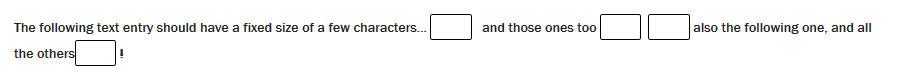
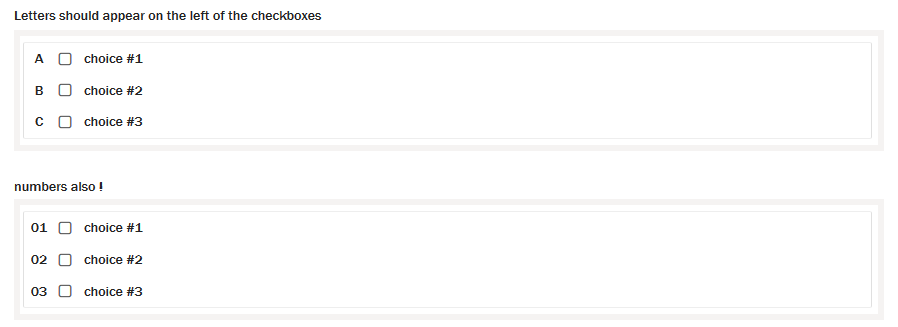
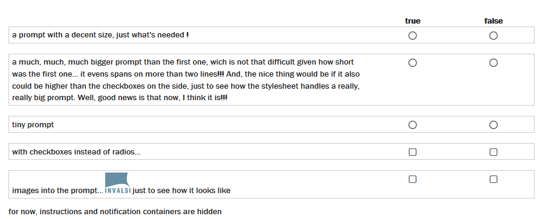
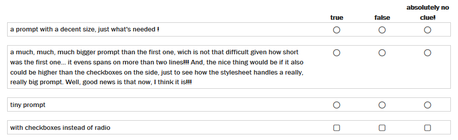

  # CSS SDK Recipes and Snippets

A collection of re-usable code snippets grouped into several sections. Most of them have been created for real projects and they may feature colors, borders and such that are not applicable for your current project - copy and paste probably won't be good enough. If you are writing new code that could be interesting for this collection feel free to copy it in here. Consider to add screen shots where appropriate but make sure they don't exceed 900px in width.

## Code block modifications

This part concerns *interactions* as well as *rubric blocks* or any other content section. Besides the usual way of editing your styles you can also choose to use them only on items that have certain scopes. A scope in this context is a CSS class on the item that can be added or removed by the item author. 

If you don't require scopes you can from here proceed to the [recipes](#available-recipes) immediately.

### Using scopes
To make scopes available some programming steps are required. The directory `interaction-mods/customerExtension` contains all applicable files. Make sure to replace `__customerExtension__` everywhere by the actual name of your extension. 

### Configuration

Let's say, you want one or more interactions to have a thick red border all around. Edit the variable `blocks` inside `customerExtension/views/js/cssBlocks/cssConfig.js` like this:
    
    var blocks = [
        {
            className: 'thick-red-border',
            label: __('Thick red border')
        }
    ];

Do this for all the custom styles you want to add. In the style section of the item editor this will create a checkbox with a label for each entry that allows the item author to apply a scope to the item.

### SCSS

The thick red border should be used on the `example-interaction`. An untouched `_example.scss` would look like this:

    .example-interaction {
        // code applicable to all example-interactions in all items
    }
    
Add a selector `.__custom__thick-red-border {}` to `_example.scss`. Note that the `__custom__` prefix is always added to avoid conflicts. Now copy the skeleton code between the brackets and your file will look like this:

    .example-interaction {
        // code applicable to example-interactions in all items
    }
    
    .__custom__thick-red-border {    
        .example-interaction {
            // code applicable to example-interactions in items that have the class __custom__thick-red-border
        }
    }

You can do this either on one or multiple interactions or in `_all-interactions.scss`.

### Recipes

None of the recipes uses custom scopes but obviously they can be used inside one.

#### Center picture
Turns all pictures inside an interaction into block elements and centers them.

*Example in `_all-interactions.scss`*

#### Remove instructions
Hides the message boxes that are available above all block interactions. You can also use specific classes, e.g. `.instruction-container.feedback-warning` instead of `.instruction-container` to address only certain instructions. Available types are `.feedback-error`, `.feedback-info`, `.feedback-success` and `.feedback-warning`.

*Example in `_all-interactions.scss`*

#### Text entry interactions with fixed sizes
Text entry interactions usually have a style attribute that indicates the length of the expected text (http://tinyurl.com/expectedLength), this recipe will apply a fixed size instead.

##### Text entry fixed size

*Example in `_text-entry.scss`*

#### Move bullets to the left side of a checkbox
Choice interactions can have bullets or enumeration of all types available for `<ol>` or `<ul>`. With the regular stylesheet the order from left to right is checkbox/radio button, then enumeration, then label. This recipe moves the enumeration to the left of the checkbox.

##### Example

*Example in `_choice.scss`*

#### Display multiple choice interactions as one table
In this one multiple horizontal choice interactions are displayed similarly to a match interaction. The order of each row is prompt, then checkbox/radio button one, then checkbox/radio button two etc. The checkbox/radio button labels must be the same on each row and will be used as table headings.

##### Two choices

##### Three choices

*Example in `_choice.scss`*

#### Gap Match as a listing
The choices of a gap match interaction will be displayed like a regular unordered list.

*Example in `_gap-match.scss`*

## Fonts

The font recipes can be used on either the items or the platform. The web fonts are usually generated at [Font Squirrel](http://www.fontsquirrel.com). The directory *assets* contains the original fonts along with the license and the generator settings used on Font Squirrel.

The font families are combined so you require only one CSS declaration 

    @import './inc/font-face';

    html {
        body {  
            div.qti-item {
                font-family: "My Font Family", sans-serif;
            }
        }
    }

### Available fonts

#### Open Dyslexic
> OpenDyslexic is a new open source font created to increase readability for readers with dyslexia. The typeface includes regular, bold, italic, and bold-italic styles. It is being updated continually and improved based on input from dyslexic users.

<cite>[Open Dyslexic Website](http://opendyslexic.org/)</cite>

#### Open Dyslexic Alta
Same as above but with a rounded *a*

#### Roboto
> Roboto is a neo-grotesque sans-serif typeface family developed by Google as the system font for its mobile operating system Android.

<cite>[Wikipedia](https://en.wikipedia.org/wiki/Roboto)</cite>

#### Istok
> Istok Web is an original typeface, in development since 2008. At first some basic letters were based on specially modified METAFONT sources from the CM Bright font family from the TeX community. [...] But in fact Istok fonts are now very far from this origin. 

<cite>[Google Fonts](https://www.google.com/fonts/specimen/Istok+Web)</cite>

### Using the font recipes

- merge `.scss` files with you project files
- copy `fonts` at the root of your css directory
- adapt the paths in `_font-face.scss` if needed
